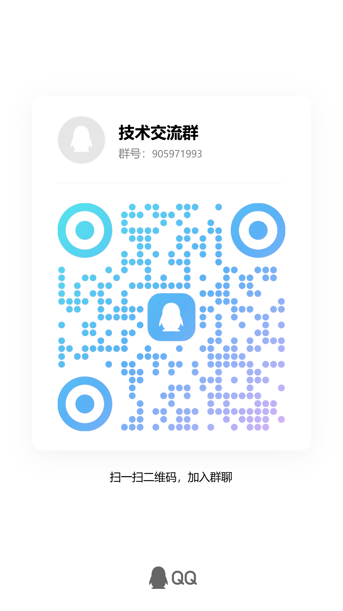

<div align="center">

# QwenHub 千问枢纽

**自托管 · OpenAI 兼容 · 千问多账户网关**

把 `chat.qwen.ai` 变成你自己的 OpenAI API —— 多账户轮询 · 流式 SSE · 工具调用 · 上下文外置 · 中文仪表盘

[](https://qm.qq.com/cgi-bin/qm/qr?k=QwenHub群905971993)
[](LICENSE)
[](https://bun.sh)
[](https://www.typescriptlang.org/)

</div>


<div align="center">

### 💬 技术交流群

**QQ 群号：905971993**

<br>



*扫一扫二维码，加入群聊*

</div>
> **免责声明**：本项目仅供学习与研究。它通过 `chat.qwen.ai` 提供模型访问，与阿里巴巴/通义千问官方无关。使用者须遵守 `chat.qwen.ai` 服务条款。

---

## 这是什么

QwenHub 是一个**自托管的 OpenAI 兼容 API 网关**。部署后，你得到一个本地端点 `http://localhost:26405/v1`，任何支持 OpenAI 协议的工具都能直接调用 Qwen 系列模型：

- **DeepSeek Harness / Codex / Claude Code** 等 Agent 编码工具
- **OpenAI SDK**（Python / Node.js / Go...）
- **ChatGPT-Next-Web / LobeChat / Cursor** 等客户端

## 核心特性

| 能力 | 说明 |
|---|---|
| 🔁 **多账户轮询** | 配置 3+ 个千问账户，round-robin 自动分发请求，限流自动故障转移 + 冷却追踪 |
| 🧠 **上下文外置** | 大上下文自动上传为 Qwen 云端附件（`context.txt`），内联保留最近关键状态，绕开请求体大小限制 |
| 🛠 **工具调用** | 完整 OpenAI Function Calling：XML 工具解析、JSON Schema 校验、工具结果智能压缩（git diff / JSON 摘要） |
| 🌊 **流式 SSE** | 心跳保活、跨块内容过滤、thinking 分离输出（`reasoning_content`） |
| 🧹 **内容过滤管道** | 自动剥离 thinking 标签与内部产物标记 |
| 🪄 **会话池** | 浏览器会话池化复用、按负载自动扩缩、空闲自动回收 |
| 📊 **中文仪表盘** | 总览 / 请求日志 / 账户管理 / 网络调试 / 用量统计 / 监控 —— 全中文界面 |
| ⚡ **双通道传输** | 平时纯 HTTP（wreq-js TLS 指纹模拟，零浏览器开销），仅登录时用 Playwright 浏览器自动化 |
| 🖥 **集群模式** | Bun 原生 TS 执行，多核集群可选项，无需构建步骤 |

## 快速开始

### 环境要求

- [Bun](https://bun.sh) 1.3+（运行时 + 包管理器）
- Playwright 浏览器（首次登录账户时自动提示）

### 安装

```bash
git clone <你的仓库地址> qwenhub
cd qwenhub
bun install
```

### 启动

```bash
bun src/index.tsx
# 或
bun start
```

服务默认跑在 **http://localhost:26405**：

- API 端点：`http://localhost:26405/v1`
- 仪表盘：`http://localhost:26405/dashboard`

### 配置

首次启动会自动生成 `config.json`，常用项：

```jsonc
{
  "PORT": "26405",
  "HOST": "0.0.0.0",
  "API_KEY": "sk-xxxx",
  "TOOL_CALLING": "true",
  "CLEAN_OUTPUT": "true",
  "STREAMING_MODE": "auto",
  "STREAM_IDLE_TIMEOUT_MS": "60000",
  "RATE_LIMIT_COOLDOWN_MS": "120000"
}
```

全部配置项见 `src/services/configService.ts` 的 `DEFAULT_CONFIG`，或直接在仪表盘 → 设置页在线改（保存即生效）。

### 添加账户

> **最佳实践**：配 3 个以上账户做轮询，单个账户限流时自动切到下一个，冷却时间几乎无感。**不要**用个人主力千问账户，建议注册专用账户。

1. 打开仪表盘 → **账户管理**
2. 输入千问邮箱和密码 → 点 **添加账户**
3. 网关自动完成登录与会话保持（遇到人机验证可用面板内置的浏览器 screencast 手动过一次）

### 接入你的工具

**DeepSeek Harness / Codex / 任何 OpenAI 客户端：**

```
Base URL:  http://127.0.0.1:26405/v1
API Key:   <你 config.json 里配的 API_KEY>
Model:     qwen3.7-plus
```

**Python 示例：**

```python
from openai import OpenAI

client = OpenAI(
    api_key="sk-xxxx",
    base_url="http://127.0.0.1:26405/v1",
)

stream = client.chat.completions.create(
    model="qwen3.7-plus",
    messages=[{"role": "user", "content": "你好"}],
    stream=True,
)
for chunk in stream:
    if chunk.choices[0].delta.content:
        print(chunk.choices[0].delta.content, end="")
```

**curl：**

```bash
curl http://127.0.0.1:26405/v1/chat/completions \
  -H "Content-Type: application/json" \
  -H "Authorization: Bearer sk-xxxx" \
  -d '{"model":"qwen3.7-plus","stream":true,"messages":[{"role":"user","content":"你好"}]}'
```

## 可用模型

`qwen3.7-plus` · `qwen3.8-max` · `qwen3.7-max` · `qwen3.6-plus` · `qwen3.5-plus` · `qwen3.5-omni-plus`

模型名后缀 `-no-thinking` 可关闭思考过程。完整列表：`GET /v1/models`。

## 自定义系统提示词

QwenHub 支持把自定义提示词写入每个账户的云端 `personalization.instruction`（等同官方网页的"自定义指令"），所有会话统一生效：

- 仪表盘 → 设置 → 系统与账户 → 开启 `USE_CUSTOM_INSTRUCTION` 并填写内容
- 关闭该开关则使用内置的 Agent 格式默认提示词

## 仪表盘

| 页面 | 路径 | 功能 |
|---|---|---|
| **总览** | `/dashboard` | KPI、模型健康度、会话池、系统日志 |
| **账户管理** | `/dashboard/accounts` | 添加/移除账户、认证状态、限流情况、内置浏览器登录 |
| **用量统计** | `/dashboard/usage` | 按账户 × 模型的请求数、限流次数、日额度估算 |
| **网络调试** | `/dashboard/network` | 出站请求实时检查器 |
| **监控** | `/dashboard/monitor` | 成功率、延迟分布（P95/中位数）、账户维度指标 |
| **设置** | `/dashboard/settings` | 全部配置在线编辑，保存即生效 |

## API 端点

| 端点 | 方法 | 说明 |
|---|---|---|
| `/v1/chat/completions` | POST | 聊天补全（流式/非流式/工具调用） |
| `/v1/models` | GET | 模型列表 |
| `/api/accounts` | GET/POST | 账户管理 |
| `/api/config` | GET/PUT | 配置读写 |
| `/api/usage` | GET | 用量统计 |
| `/system/logs` | GET | 系统日志 |
| `/metrics/monitor` | GET | 监控指标 |
| `/health` | GET | 健康检查 |

完整 API 文档见 [docs/API.md](docs/API.md)，架构说明见 [docs/ARCHITECTURE.md](docs/ARCHITECTURE.md)。

## 常见问题

**Q: 提示 401 Unauthorized？**
A: `config.json` 里配了 `API_KEY`，请求需要带 `Authorization: Bearer <你的key>`。

**Q: 提示 404 Model not found？**
A: 模型名写错了。先查 `GET /v1/models` 返回的实际模型 ID。

**Q: 偶发 `Upstream stream idle timeout`？**
A: 上游偶发"会话假死"，网关会在 60 秒后主动断开。多配几个账户轮询即可稀释这种情况。

**Q: 请求体太大被上游拒绝？**
A: 内置的上下文外置机制会自动把大历史上传为云端附件，一般无需手动干预。

**Q: 127.0.0.1 连不上？**
A: `config.json` 的 `HOST` 留空时部分系统只绑 IPv6。改成 `"0.0.0.0"` 并重启。

## 项目结构

```
src/
├── index.tsx              # Hono 服务器、路由、鉴权
├── cluster.ts             # 多核集群模式
├── cli.ts                 # qg 命令行入口
├── routes/                # API 路由与仪表盘
│   ├── chat.ts            # 聊天请求调度（多账户重试）
│   ├── chatStreaming.ts   # 流式 SSE
│   ├── chatNonStreaming.ts
│   ├── compressToolResult.ts  # 工具结果压缩
│   └── dashboard/         # 中文 Web 仪表盘
├── services/              # 业务逻辑
│   ├── accountManager.ts  # 账户 CRUD 与轮询
│   ├── auth.ts            # 登录与会话
│   ├── sessionPool.ts     # 会话池
│   ├── qwen.ts            # Qwen API 交互
│   └── qwenFileUpload.ts  # 文件上传（上下文外置）
├── tools/                 # 工具调用系统（解析/校验/防滥用）
└── utils/                 # 内容过滤、重试、令牌估算等
```

## License

MIT

## 交流

- 💬 **QQ 技术交流群**：`905971993`（扫顶部二维码加入）

## 致谢

本项目在开源社区实践基础上改进而来（upstream: qwen-gate, MIT）。
